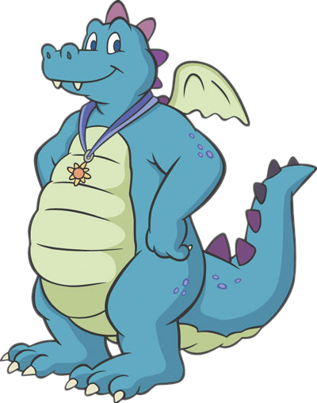
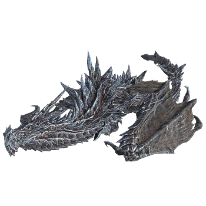
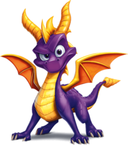

---  
title: "Dragon Phylogeny Assignment"
author: "Jayde MacMillan 20068250"
date: "3/7/2022"
output: html_document
---  
  
[Github - jaydealexandra](https://github.com/jaydealexandra/DragonPhylogeny.git)  
  
## Setup  
  
Loads the required libraries. 
```{r}
library(ape)
library(reshape2)
library(ggplot2)
library(ggtree)
library(ggimage)
```
  
Imports 'DragonMatrix.nex' into an object called 'DragonNexus'.
```{r}
DragonNexus <- read.nexus.data("input/DragonMatrix.nex")
```
  
  
## Dragons 
  
The following dragons were added into the 'DragonMatrix.nex' dataset.
  
**Ord** from Dragon Tales. This image is from [Dragon Tales Wikia](https://dragontales.fandom.com/wiki/Ord)

  
  
**Alduin** from Elder Scrolls. This image is from [Skyrim Wiki](https://skyrim.fandom.com/wiki/Alduin)
  
  
  
**Spyro** from Spyro the Dragon. This image is from [Wikipedia](https://en.wikipedia.org/wiki/Spyro_(character))

  
  
## Weights 
  
  
Imports 'Weight.csv' into a single vector and splits it into substrings.
```{r}
WeightsDat<-read.csv("input/Weights.csv") #imports 'Weights.csv'
Weights<-paste0(WeightsDat$Weight,collapse="") #links vectors together after converting to character
Weights<-strsplit(Weights,split="")[[1]] #splits the character vector into substrings
```
  
  
Converts each letter to a value using a custom function.
```{r}
WeightsNum<-rep(NA,length(Weights))
for(i in 1:length(WeightsNum)){
  if(Weights[i] %in% LETTERS){
    WeightsNum[i]<-which(LETTERS==Weights[i])+9
  } else {
    WeightsNum[i]<-Weights[i]
  }
}
WeightsNum<-as.numeric(WeightsNum)
```
  
  
Multiplies the weight value by the trait vector for each dragon.
```{r}
WtDragonNexus<-DragonNexus # Make a new weighted data frame object
for (i in 1:length(DragonNexus)){
  RepWeight<-DragonNexus[[i]]==1
  WtDragonNexus[[i]][RepWeight]<-WeightsNum[RepWeight]
  RepWeight<-NA
}
```
  
  
## Distance Matrix  
  
  
Uses the `unlist` function to turn the object into a vector, then converting it to a matrix. 
```{r}
WtDragonNexusDF<-data.frame(matrix(unlist(WtDragonNexus),ncol=78,byrow=T)) #unlists and creates a dataframe
row.names(WtDragonNexusDF)<-names(WtDragonNexus)  #sets the row names

WtDragonDist<-dist(WtDragonNexusDF,method='euclidean') #computes the distance between the rows of the data matrix using the euclidean method
WtDragonDistMat<-as.matrix(WtDragonDist) #creates a matrix using the weighted data
```
  
  
## Tree Formatting
  
Builds a phylogeny.
```{r}
WtDragonTree<-fastme.bal(WtDragonDist)
```
  
Colour by OTU.
```{r}
base <- gsub("[0-9\\.]+([^X]+)X*","\\1", WtDragonTree$tip.label) # Remove leading numbers

baseGroups<-split(WtDragonTree$tip.label, base=="Fiction") # Splits 'WtDragonTree$tip.label' by Fiction

WtDTcol<-groupOTU(WtDragonTree, baseGroups) # Groups OTUs

imagesDF <- data.frame(node = c(78,79,80), #specifies nodes
                       images = c("images/A7_MACMILLAN_JAYDE_Ord.png", #specifies images
                                  "images/A7_MACMILLAN_JAYDE_Alduin.png",
                                  "images/A7_MACMILLAN_JAYDE_Spyro.png"))


ggtree(WtDTcol, branch.length='note') %<+% imagesDF +
  geom_tree(aes(colour=group)) +
  geom_tiplab(aes(image=images), geom = "image", offset=2, size = 0.05) +
  geom_tiplab(size=2) +
  theme(legend.position = "none") +
  xlim(0,50)
```


